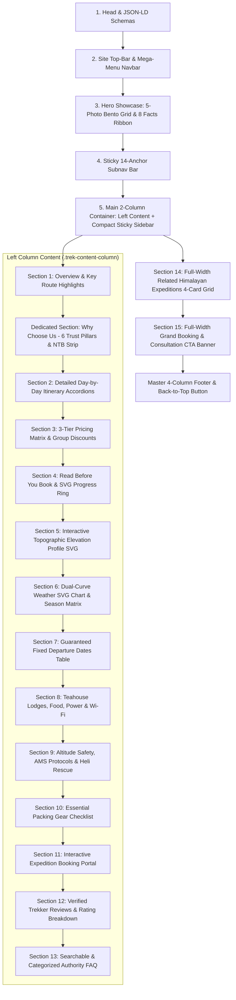

# Trek Page Builder Skill (`trek-page-builder`)

This skill provides the comprehensive design system, component hierarchy, technical requirements, code templates, interactive JavaScript controllers, and structured schema blueprints for creating world-class **Trek Package Detail Pages** for **Best Treks Nepal**, strictly modeled on the gold standards established in [`treks/everest-base-camp.html`](file:///c:/Users/ASUS/Desktop/Best%20Treks%20Nepal/treks/everest-base-camp.html) and [`treks/gokyo-lakes.html`](file:///c:/Users/ASUS/Desktop/Best%20Treks%20Nepal/treks/gokyo-lakes.html).

---

## 1. Core Architectural Standards & Pillars

Every trek detail page must adhere to the following golden architectural standards:

1. **Master Header & Navigation**:
   - Top information bar with phone (`+977 1 470 0000`), email (`info@besttreksnepal.com`), and social icons (Facebook, Instagram, WhatsApp).
   - **Destinations Mega-Menu**: 2-column rich panel featuring all 8 trekking regions (*Everest, Annapurna, Langtang, Manaslu, Mustang, Dolpo, Kanchenjunga, Makalu*) with altitude tags, thumbnail photography, descriptions, and curated travel guide articles.
   - **Trek Packages Dropdown**: 2-column icon menu with trip duration, max elevation, and difficulty tags with active page highlighting.
   - **Instant Search Modal**: Search dialog with live results and `ESC` key dismissal.
   - **Mobile Menu Drawer**: Responsive slide-out navigation with destination and package groups.
   - **Scroll Progress Bar**: Top thin scroll indicator (`#navbar-progress`).
   - Module script connection to `/assets/js/main.js`.
2. **Clean White Hero Showcase (`.trek-hero-showcase`)**:
   - Breadcrumb navigation (`Home > Treks > [Region] > [Trek Name]`).
   - High-contrast visual hierarchy with a 5-photo bento grid (`.hero-bento-gallery`).
   - Fullscreen category-filtered modal lightbox (`#trekGalleryLightbox`) with thumbnail ribbon, keyboard navigation (`ArrowLeft`, `ArrowRight`, `Escape`), and 4K documentary trailer trigger (`#videoModal`).
   - **8-Card Quick Facts Ribbon (`.hero-facts-strip`)**: Duration, Max Elevation, Trek Grade, Best Season, Trip Type, Accommodation, Meals Provided, and Transport — rendered with crisp inline SVG vector icons and rounded icon badges (`.fact-card__icon-badge`). **Strictly zero raw unicode emojis**.
3. **Docked Sticky Sub-navigation Bar (`.trek-subnav-sticky`)**:
   - **Docking Rule**: `.trek-subnav-sticky` must use `position: sticky; top: 0; z-index: 95; background: rgba(255, 255, 255, 0.98); backdrop-filter: blur(12px); border-bottom: 1px solid #e2e8f0; box-shadow: 0 4px 20px rgba(0, 0, 0, 0.06);`.
   - **Offset Alignment**: `.trek-sidebar` must use `top: 75px;`, `.trek-section` must use `scroll-margin-top: 85px;`, and ScrollSpy JS listener must use `window.scrollY + 100`.
   - 14 quick jump anchors (`#overview`, `#why-choose`, `#itinerary`, `#pricing`, `#briefings`, `#elevation`, `#weather`, `#departures`, `#lodges`, `#safety`, `#gear`, `#book`, `#reviews`, `#faq`) with real-time active scrollspy highlight.
4. **2-Column Responsive Body Layout (`<main class="container">`)**:
   - **Left Column (`.trek-content-column`)**: Must have `min-width: 0; max-width: 100%;` to prevent pricing matrix blowouts. Houses Sections 1 to 13 (Overview, Dedicated Why Choose Us Block, Itinerary, 3-Tier Pricing, Knowledge Base, Elevation, Weather, Departures, Lodges, Safety, Gear, Booking Portal, Climber Reviews, and Searchable FAQ).
   - **Right Column (`.trek-sidebar`)**: Compact, high-converting sticky conversion sidebar (< 550px height) with price card, 15% flexible deposit indicator, live green pulse urgency pill, 4-inline spec pills, 3 core trust bullets, compact primary booking + WhatsApp buttons, and SSL/NTB security footer.
5. **Dedicated "Why Choose Best Treks Nepal" Section (`#why-choose`)**:
   - Placed right below Section 1 Overview. Features a high-contrast card (`.why-choose-block`) with the gold/teal *The Best Treks Nepal Advantage* badge, 6 authority & trust cards (Paced Acclimatization, 100% Native Khumbu Sherpas, Route Advantages, Twice-Daily Oximetry, 24/7 Satellite Heli Dispatch, and 15% Flexible Deposit), and the NTB/TAAN government verification quote footer with direct booking CTA.
6. **Detailed Day-by-Day Itinerary (`#itinerary`)**:
   - Interactive `<details class="itinerary-day-card">` accordions with day badges, distance, duration, elevation, and 4-pill metadata strips (`.stat-pill`).
   - Every stat pill must use vector inline SVGs (pin, flight, flag, boot, mountain, lodge).
   - Every day includes a dedicated `.sherpa-tip-box` featuring a `.sherpa-tip-icon` SVG bulb badge.
7. **Interactive Knowledge Base with Circular SVG Progress Tracker (`#briefings`)**:
   - Circular progress tracker card (`.kb-progress-box`) with high-contrast white typography (`color: #ffffff !important;` on `h4` and `.kb-ring-text`) and a live green SVG progress ring (`#readProgressCircle`) updating percentage in real time (`0/12` to `12/12 (100%)`).
   - 12 comprehensive accordion topics with in-depth technical guides, structured preparation tables, gear/boot ankle support criteria, and dedicated `.read-topic-callout` tip boxes.
8. **Dual-Curve SVG Weather Engine (`#weather`)**:
   - Interactive temperature graph supporting `Route Progression` (per waypoint stop) vs `12-Month Climate` (annual seasonal averages), dynamic month selector dropdown, instant `°C` / `°F` conversion switcher, red dashed `0°C Freezing` reference threshold, and a 4-season climate matrix grid (`.weather-seasons-grid`).
9. **Interactive Topographic Elevation Profile SVG Chart (`#elevation`)**:
   - Scaled vector canvas (`viewBox="0 0 940 380"`) with multi-stop linear gradient (`#elevGradMaster` emerald-to-teal), high-contrast 3.5px line path, left-aligned dashed altitude gridlines (`4,600m`, `4,000m`, `3,400m`, `2,800m`, `2,600m`), waypoint altitude callout tags (`56x20` rounded pills), collision-free 2-tier stacked labels (`Village / Day N`), prominent summit/pass pin badge with halo glow and drop-shadow (`filter="url(#badgeShadow)"`), 4-card statistics ribbon (`.elevation-stats-strip`), and a Sherpa acclimatization safety principle callout box.
10. **Guaranteed Fixed Departures Strip & Table (`#departures`)**:
    - Compact 5-row default view with `"View All Fixed Departures ↓"` expansion toggle, season filter tabs (*All, Spring, Autumn, Winter*), and private trek consultation card.
11. **4-Pillar Alpine Teahouses & Trail Hospitality (`#lodges`)**:
    - High-conversion 4-pillar grid (`.four-pillar-grid`) detailing authentic family-run Sherpa teahouses, high-altitude mountain nutrition (organic *Dal Bhat*, *Riki Kur*, garlic soups), solar power/charging hubs with Everest Link & 4G connectivity, and eco hydration/gas-geyser hot showers, finished with a Sherpa dining hall tradition callout box.
12. **4-Pillar Wilderness Medical Standards & Emergency Rescue (`#safety`)**:
    - High-conversion 4-pillar grid (`.four-pillar-grid`) detailing twice-daily pulse oximetry ($SpO_2$) & Lake Louise logs, comprehensive expedition pharmacy & emergency oxygen, 24/7 Garmin inReach satellite tracking connected to Kathmandu dispatch, and cashless emergency helicopter rescue standby, finished with a clinical physiological safety callout.
13. **4-Category Essential Packing Gear Checklist & 4-Layer System (`#gear`)**:
    - 4-category bento grid detailing Upper Body & Warmth, Lower Body & Weather Protection, Footwear & Trail Grip, and Hardware & Technical Accessories, accompanied by our complimentary gear guarantee callout (free 100L duffel, -15°C down sleeping bag, and 800-fill down jacket).
14. **Interactive 5-Step Expedition Booking Portal (`#book`)**:
    - Interactive 5-step booking portal (`.booking-portal-box`) with package tier radios, departure date selection, live group size stepper ($+/-$, 1–12 pax), automatic 15% deposit and remaining 85% balance calculations strip (`.booking-calc-strip`), lead traveler inputs, and query string handoff to `/booking.html`.
15. **Verified Climber & Trekker Reviews (`#reviews`)**:
    - Grand 4.95 scorecard banner with 5 glowing stars, total verified expeditions count, and 99.2% summit completion metrics.
    - 4-card detailed international testimonial grid with country flags, verified reviewer avatar badges, date tags, and authentic experiential feedback.
16. **Site-Standard Searchable & Categorized FAQ (`#faq`)**:
    - Instant live search input with query matching and auto-expansion.
    - Category filter tabs (*All, Route & Altitude, Logistics & Flights, Teahouses & Meals, Safety & Booking*) with live count indicators.
    - 10–12 comprehensive FAQ accordions with detailed Sherpa advice callouts (`.faq-item__callout`).
    - High-contrast `.faq-support-card` linking to WhatsApp Sherpa consultation and custom inquiry form.
17. **CRITICAL: Full-Width Sections 14 & 15 Placed Outside the 2-Column Main Layout**:
    - **Section 14: Related Himalayan Expeditions (`.related-expeditions-section`)**: Must be an independent full-width `<section>` with its own `<div class="container">` placed **outside and below `</main>`**. Features a 4-card responsive grid with image zoom on hover, spec pills, bulleted highlights, and `View Trek →` CTA buttons.
    - **Section 15: Grand Booking & Consultation CTA Banner (`.grand-cta-banner-section`)**: Must be an independent full-width `<section>` placed directly below Section 14 and right above the Master Footer. Features an atmospheric Himalayan gradient background, high-contrast white title (`#ffffff !important; text-shadow: 0 4px 20px rgba(0,0,0,0.4);`), top trust badge, 4-pillar benefit grid, primary golden booking button, WhatsApp button, and 4-item SVG trust guarantee strip.
18. **Master 4-Column Footer & Back to Top**:
    - Complete 4-column footer (Brand/Socials, Quick Links, Destinations, Contact) with dynamic copyright year `<span data-year>` and floating `.back-to-top` button.-top` button.

---

## 2. Standard 15-Section Sequence Blueprint

Every trek package detail page must strictly follow this sequence:



---

## 3. Production Component Blueprints

### A. Compact Sticky Conversion Sidebar
```html
<aside class="trek-sidebar">
  <!-- Price Hero Card -->
  <div class="sidebar-price-card">
    <div class="sidebar-price-top">
      <div class="sidebar-price-tag">
        <span class="sidebar-currency">$</span>
        <span class="sidebar-amount">{Price}</span>
        <span class="sidebar-unit">USD / pax</span>
      </div>
      <span class="sidebar-badge-gold">★ 4.9 Rating</span>
    </div>
    <div class="sidebar-price-sub">
      <span>100% Best Price Guarantee</span>
      <span class="sidebar-deposit-tag">15% Deposit (${Deposit})</span>
    </div>
    <div class="sidebar-flight-tag">
      <svg width="13" height="13" viewBox="0 0 24 24" fill="none" stroke="currentColor" stroke-width="2.5"><path d="M17.8 19.2 16 11l3.5-3.5C21 6 21.5 4 21 3c-1-.5-3 0-4.5 1.5L13 8 4.8 6.2c-.5-.1-.9.1-1.1.5l-.3.5c-.2.5-.1 1 .3 1.3L9 12l-2 3H4l-1 1 3 2 2 3 1-1v-3l3-2 3.5 5.3c.3.4.8.5 1.3.3l.5-.2c.4-.3.6-.7.5-1.2z"/></svg>
      <span>{Transport / Flight Included}</span>
    </div>
  </div>

  <!-- Single-Line Urgency Pill -->
  <div class="sidebar-urgency-pill">
    <span class="sidebar-pulse-dot"></span>
    <span>⚡ Next: {Next Date} · Guaranteed ({Spots} spots left)</span>
  </div>

  <!-- 4-Column Inline Bento Specs (Pure Inline SVG Vectors) -->
  <div class="sidebar-specs-bento">
    <div class="sidebar-spec-box">
      <div class="sidebar-spec-icon">
        <svg width="15" height="15" viewBox="0 0 24 24" fill="none" stroke="#0f5257" stroke-width="2.2"><circle cx="12" cy="12" r="10"/><polyline points="12 6 12 12 16 14"/></svg>
      </div>
      <span class="sidebar-spec-val">{Duration}D</span>
      <span class="sidebar-spec-lbl">Duration</span>
    </div>
    <div class="sidebar-spec-box">
      <div class="sidebar-spec-icon">
        <svg width="15" height="15" viewBox="0 0 24 24" fill="none" stroke="#0f5257" stroke-width="2.2"><path d="m8 3 4 8 5-5 5 15H2L8 3z"/></svg>
      </div>
      <span class="sidebar-spec-val">{Elevation}m</span>
      <span class="sidebar-spec-lbl">Max Alt</span>
    </div>
    <div class="sidebar-spec-box">
      <div class="sidebar-spec-icon">
        <svg width="15" height="15" viewBox="0 0 24 24" fill="none" stroke="#0f5257" stroke-width="2.2"><path d="M22 12h-4l-3 9L9 3l-3 9H2"/></svg>
      </div>
      <span class="sidebar-spec-val">{Difficulty}/5</span>
      <span class="sidebar-spec-lbl">Grade</span>
    </div>
    <div class="sidebar-spec-box">
      <div class="sidebar-spec-icon">
        <svg width="15" height="15" viewBox="0 0 24 24" fill="none" stroke="#0f5257" stroke-width="2.2"><path d="M17 21v-2a4 4 0 0 0-4-4H5a4 4 0 0 0-4 4v2"/><circle cx="9" cy="7" r="4"/></svg>
      </div>
      <span class="sidebar-spec-val">Max 10</span>
      <span class="sidebar-spec-lbl">Group</span>
    </div>
  </div>

  <!-- 3 Core Trust Bullets -->
  <ul class="sidebar-benefits-list">
    <li class="sidebar-benefit-item"><span class="sidebar-check-icon">✓</span><span>100% Guaranteed Departures</span></li>
    <li class="sidebar-benefit-item"><span class="sidebar-check-icon">✓</span><span>{Transport Assurances}</span></li>
    <li class="sidebar-benefit-item"><span class="sidebar-check-icon">✓</span><span>Free Rescheduling &amp; All Permits</span></li>
  </ul>

  <!-- High-Converting Action Buttons -->
  <a href="#book" class="sidebar-btn-primary">
    <span>Check Dates &amp; Book Online</span>
    <svg width="15" height="15" viewBox="0 0 24 24" fill="none" stroke="currentColor" stroke-width="2.5"><polyline points="9 18 15 12 9 6"/></svg>
  </a>

  <a href="https://wa.me/9771234567890" target="_blank" rel="noopener" class="sidebar-btn-whatsapp">
    <svg width="15" height="15" viewBox="0 0 24 24" fill="currentColor"><path d="M17.472 14.382c-.297-.149-1.758-.867-2.03-.967-.273-.099-.471-.148-.67.15-.197.297-.767.966-.94 1.164-.173.199-.347.223-.644.075-.297-.15-1.255-.463-2.39-1.475-.883-.788-1.48-1.761-1.653-2.059-.173-.297-.018-.458.13-.606.134-.133.298-.347.446-.52.149-.174.198-.298.298-.497.099-.198.05-.371-.025-.52-.075-.149-.669-1.612-.916-2.207-.242-.579-.487-.5-.669-.51-.173-.008-.371-.01-.57-.01-.198 0-.52.074-.792.372-.272.297-1.04 1.016-1.04 2.479 0 1.462 1.065 2.875 1.213 3.074.149.198 2.096 3.2 5.077 4.487.709.306 1.262.489 1.694.625.712.227 1.36.195 1.871.118.571-.085 1.758-.719 2.006-1.413.248-.694.248-1.289.173-1.413-.074-.124-.272-.198-.57-.347z"/><path d="M12 2C6.477 2 2 6.477 2 12c0 1.89.525 3.66 1.438 5.168L2 22l4.832-1.438A9.946 9.946 0 0 0 12 22c5.523 0 10-4.477 10-10S17.523 2 12 2z"/></svg>
    <span>WhatsApp Sherpa Expert</span>
  </a>

  <!-- Compact Security Footer -->
  <div class="sidebar-trust-footer">
    <div class="sidebar-trust-row">
      <svg width="13" height="13" viewBox="0 0 24 24" fill="none" stroke="currentColor" stroke-width="2.5"><rect x="3" y="11" width="18" height="11" rx="2" ry="2"/><path d="M7 11V7a5 5 0 0 1 10 0v4"/></svg>
      <span>256-Bit SSL Encrypted Secure Booking</span>
    </div>
    <span>TAAN &amp; Nepal Tourism Board Authorized Partner</span>
  </div>
</aside>
```

---

### B. Site-Standard Searchable FAQ Blueprint
```html
<section class="section" id="faq" aria-label="Frequently Asked Questions">
  <div class="faq-container">
    
    <div class="section-header">
      <span class="section-tag">Essential Preparation</span>
      <h2 class="section-title">Frequently Asked Questions</h2>
      <p class="section-subtitle">Direct answers from our senior expedition leaders covering routes, safety, packing, permits, and teahouse life.</p>
    </div>

    <!-- Search Engine & Filter Strip -->
    <div class="faq-controls-bar">
      <div class="faq-search-box">
        <svg width="16" height="16" viewBox="0 0 24 24" fill="none" stroke="currentColor" stroke-width="2.5"><circle cx="11" cy="11" r="8"/><line x1="21" y1="21" x2="16.65" y2="16.65"/></svg>
        <input type="text" id="faqSearchInput" placeholder="Search questions (e.g. altitude, flights, gear, food)..." oninput="filterFaqQuestions()">
      </div>

      <div class="faq-category-tabs">
        <button type="button" class="faq-tab-btn is-active" onclick="setFaqCategory('all', this)">All Questions (12)</button>
        <button type="button" class="faq-tab-btn" onclick="setFaqCategory('route', this)">Route &amp; Altitude</button>
        <button type="button" class="faq-tab-btn" onclick="setFaqCategory('logistics', this)">Flights &amp; Luggage</button>
        <button type="button" class="faq-tab-btn" onclick="setFaqCategory('lodges', this)">Teahouses &amp; Meals</button>
        <button type="button" class="faq-tab-btn" onclick="setFaqCategory('safety', this)">Safety &amp; Booking</button>
      </div>
    </div>

    <div id="faqCountDisplay" class="faq-count-display">Showing all 12 questions</div>

    <!-- Standard Details Accordion List -->
    <div class="faq-accordion-list" id="faqAccordionList">
      <details class="faq-item" data-category="route">
        <summary class="faq-item__trigger">
          <span class="faq-item__badge faq-item__badge--teal">Route &amp; Difficulty</span>
          <span class="faq-item__question">{Question Title}</span>
          <span class="faq-item__toggle-icon" aria-hidden="true">+</span>
        </summary>
        <div class="faq-item__body">
          <div class="faq-item__content">
            <p>{Detailed comprehensive explanation.}</p>
            <div class="faq-item__callout">
              <strong>💡 Sherpa Advice:</strong> {Expert tip box.}
            </div>
          </div>
        </div>
      </details>
    </div>

    <!-- Site-Standard Support Card -->
    <div class="faq-support-card">
      <div class="faq-support-card__content">
        <h3 class="faq-support-card__title">Have a specific question not covered here?</h3>
        <p class="faq-support-card__text">Our Kathmandu operations team and licensed Sherpa guides are available 24/7 on WhatsApp.</p>
      </div>
      <div class="faq-support-card__actions">
        <a href="https://wa.me/9771234567890" target="_blank" rel="noopener" class="btn btn--whatsapp">
          <svg width="18" height="18" viewBox="0 0 24 24" fill="currentColor"><path d="..."/></svg>
          <span>WhatsApp Sherpa Support</span>
        </a>
        <a href="/contact.html" class="btn btn--secondary">Send Custom Inquiry →</a>
      </div>
    </div>

  </div>
</section>
```

---

### C. Dedicated Why Choose Us Block Blueprint (`#why-choose`)
```html
<section class="trek-section" id="why-choose" style="margin-top: 0;">
  <div class="why-choose-block" style="background: linear-gradient(135deg, #f8fafc 0%, #f1f5f9 100%); border: 1.5px solid #e2e8f0; border-radius: 24px; padding: 2.25rem 2rem; box-shadow: 0 10px 30px -10px rgba(15, 82, 87, 0.08);">
    
    <div style="margin-bottom: 1.75rem;">
      <div style="display: inline-flex; align-items: center; gap: 0.45rem; background: #e0f2fe; border: 1px solid #bae6fd; border-radius: 999px; padding: 0.3rem 0.85rem; font-size: 0.78rem; font-weight: 700; color: #0369a1; margin-bottom: 0.65rem;">
        <svg width="14" height="14" viewBox="0 0 24 24" fill="currentColor"><polygon points="12 2 15.09 8.26 22 9.27 17 14.14 18.18 21.02 12 17.77 5.82 21.02 7 14.14 2 9.27 8.91 8.26 12 2"/></svg>
        <span>The Best Treks Nepal Advantage</span>
      </div>
      <h2 style="font-size: clamp(1.4rem, 2.8vw, 1.95rem); font-weight: 800; color: #0f172a; margin-bottom: 0.6rem; line-height: 1.3;">
        Why Choose the {Trek Name} with Best Treks Nepal?
      </h2>
      <p style="color: #64748b; font-size: 0.98rem; line-height: 1.65; margin: 0; max-width: 820px;">
        {Specific reason why discerning mountaineers and trekkers choose Best Treks Nepal for this specific trail and high-altitude region.}
      </p>
    </div>

    <!-- 6 Authority & Trust Pillars Grid -->
    <div style="display: grid; grid-template-columns: repeat(auto-fit, minmax(280px, 1fr)); gap: 1.25rem; margin-bottom: 1.75rem;">
      
      <!-- Pillar 1: Acclimatization / Route Design -->
      <div style="background: #ffffff; border-radius: 16px; padding: 1.35rem; border: 1px solid #e2e8f0; display: flex; gap: 1rem; align-items: flex-start;">
        <div style="width: 42px; height: 42px; border-radius: 10px; background: #e0f2fe; color: #0369a1; display: flex; align-items: center; justify-content: center; flex-shrink: 0;">
          <svg width="20" height="20" viewBox="0 0 24 24" fill="none" stroke="currentColor" stroke-width="2.5"><circle cx="12" cy="12" r="10"/><polyline points="12 6 12 12 16 14"/></svg>
        </div>
        <div>
          <h3 style="font-size: 1rem; font-weight: 700; color: #0f172a; margin-bottom: 0.3rem;">Carefully Paced Acclimatization</h3>
          <p style="font-size: 0.85rem; color: #64748b; line-height: 1.5; margin: 0;">{Progressive altitude increments ensuring our 98.8% trek success rate.}</p>
        </div>
      </div>

      <!-- Pillar 2: 100% Native Sherpas -->
      <div style="background: #ffffff; border-radius: 16px; padding: 1.35rem; border: 1px solid #e2e8f0; display: flex; gap: 1rem; align-items: flex-start;">
        <div style="width: 42px; height: 42px; border-radius: 10px; background: #ecfdf5; color: #059669; display: flex; align-items: center; justify-content: center; flex-shrink: 0;">
          <svg width="20" height="20" viewBox="0 0 24 24" fill="none" stroke="currentColor" stroke-width="2.5"><path d="M16 21v-2a4 4 0 0 0-4-4H6a4 4 0 0 0-4 4v2"/><circle cx="9" cy="7" r="4"/><path d="M22 21v-2a4 4 0 0 0-3-3.87"/><path d="M16 3.13a4 4 0 0 1 0 7.75"/></svg>
        </div>
        <div>
          <h3 style="font-size: 1rem; font-weight: 700; color: #0f172a; margin-bottom: 0.3rem;">100% Native Himalayan Sherpa Leaders</h3>
          <p style="font-size: 0.85rem; color: #64748b; line-height: 1.5; margin: 0;">Led exclusively by licensed Sherpas born in high valley villages with Wilderness First Responder (WFR) medical certifications.</p>
        </div>
      </div>

      <!-- Pillar 3: Route / Gear Edge -->
      <div style="background: #ffffff; border-radius: 16px; padding: 1.35rem; border: 1px solid #e2e8f0; display: flex; gap: 1rem; align-items: flex-start;">
        <div style="width: 42px; height: 42px; border-radius: 10px; background: #fef3c7; color: #d97706; display: flex; align-items: center; justify-content: center; flex-shrink: 0;">
          <svg width="20" height="20" viewBox="0 0 24 24" fill="none" stroke="currentColor" stroke-width="2.5"><polygon points="12 2 2 22 22 22 12 2"/><path d="m2 22 8-12 4 6 8-8"/></svg>
        </div>
        <div>
          <h3 style="font-size: 1rem; font-weight: 700; color: #0f172a; margin-bottom: 0.3rem;">{Custom Route / Gear Advantage}</h3>
          <p style="font-size: 0.85rem; color: #64748b; line-height: 1.5; margin: 0;">{Included high-altitude equipment, boutique teahouse allocations, or off-the-beaten-path trails.}</p>
        </div>
      </div>

      <!-- Pillar 4: Medical Diagnostics -->
      <div style="background: #ffffff; border-radius: 16px; padding: 1.35rem; border: 1px solid #e2e8f0; display: flex; gap: 1rem; align-items: flex-start;">
        <div style="width: 42px; height: 42px; border-radius: 10px; background: #fee2e2; color: #dc2626; display: flex; align-items: center; justify-content: center; flex-shrink: 0;">
          <svg width="20" height="20" viewBox="0 0 24 24" fill="none" stroke="currentColor" stroke-width="2.5"><path d="M22 12h-4l-3 9L9 3l-3 9H2"/></svg>
        </div>
        <div>
          <h3 style="font-size: 1rem; font-weight: 700; color: #0f172a; margin-bottom: 0.3rem;">Twice-Daily Pulse Oximeter Diagnostics</h3>
          <p style="font-size: 0.85rem; color: #64748b; line-height: 1.5; margin: 0;">Morning and evening SpO2% checks, Lake Louise AMS scoring, medical oxygen, and emergency first aid pharmacy.</p>
        </div>
      </div>

      <!-- Pillar 5: Heli Dispatch -->
      <div style="background: #ffffff; border-radius: 16px; padding: 1.35rem; border: 1px solid #e2e8f0; display: flex; gap: 1rem; align-items: flex-start;">
        <div style="width: 42px; height: 42px; border-radius: 10px; background: #f3e8ff; color: #7c3aed; display: flex; align-items: center; justify-content: center; flex-shrink: 0;">
          <svg width="20" height="20" viewBox="0 0 24 24" fill="none" stroke="currentColor" stroke-width="2.5"><path d="M12 22s8-4 8-10V5l-8-3-8 3v7c0 6 8 10 8 10z"/></svg>
        </div>
        <div>
          <h3 style="font-size: 1rem; font-weight: 700; color: #0f172a; margin-bottom: 0.3rem;">24/7 Satellite Tracking &amp; Fast Heli Dispatch</h3>
          <p style="font-size: 0.85rem; color: #64748b; line-height: 1.5; margin: 0;">Direct Garmin inReach satellite link with our Kathmandu emergency flight desk for immediate rescue helicopter deployment.</p>
        </div>
      </div>

      <!-- Pillar 6: Deposit Protection -->
      <div style="background: #ffffff; border-radius: 16px; padding: 1.35rem; border: 1px solid #e2e8f0; display: flex; gap: 1rem; align-items: flex-start;">
        <div style="width: 42px; height: 42px; border-radius: 10px; background: #e0f2fe; color: #0284c7; display: flex; align-items: center; justify-content: center; flex-shrink: 0;">
          <svg width="20" height="20" viewBox="0 0 24 24" fill="none" stroke="currentColor" stroke-width="2.5"><rect x="3" y="11" width="18" height="11" rx="2"/><path d="M7 11V7a5 5 0 0 1 10 0v4"/></svg>
        </div>
        <div>
          <h3 style="font-size: 1rem; font-weight: 700; color: #0f172a; margin-bottom: 0.3rem;">15% Flexible Deposit &amp; Lifetime Validity</h3>
          <p style="font-size: 0.85rem; color: #64748b; line-height: 1.5; margin: 0;">Lock in your dates with just a 15% deposit. Enjoy free rescheduling and full deposit transferability up to 30 days before departure.</p>
        </div>
      </div>

    </div>

    <!-- Trust Bottom Quote Strip -->
    <div style="background: #ffffff; border-radius: 14px; border: 1px solid #e2e8f0; padding: 1rem 1.25rem; display: flex; align-items: center; justify-content: space-between; flex-wrap: wrap; gap: 0.75rem;">
      <div style="display: flex; align-items: center; gap: 0.5rem;">
        <span style="color: #059669; font-weight: 900; font-size: 1.1rem;">✓</span>
        <span style="font-size: 0.85rem; font-weight: 700; color: #0f172a;">Authorized by Nepal Tourism Board (NTB) &amp; Trekking Agencies' Association of Nepal (TAAN)</span>
      </div>
      <a href="#book" class="btn btn--sm btn--primary" style="padding: 0.45rem 1rem; border-radius: 8px;">Check 2026/2027 Dates →</a>
    </div>

  </div>
</section>
```

---

### D. Knowledge Base & Technical Briefings Manual Blueprint (`#briefings`)
```html
<section class="trek-section" id="briefings">
  <span class="section-eyebrow">Essential Knowledge Base</span>
  <h2 class="section-heading-lg">Read Before You Book — Expedition Manual</h2>
  <p class="section-intro-p">
    Comprehensive logistical, medical, physical, and cultural preparation guidelines written by our senior high-altitude Sherpa expedition leaders. Expand each briefing below to track your preparation readiness.
  </p>

  <!-- Circular Progress Ring Card -->
  <div class="kb-progress-box">
    <div>
      <h4>Expedition Readiness Tracker</h4>
      <p id="kbProgressLabel">You have completed 0 of 12 preparation topics.</p>
    </div>
    <div class="kb-ring-wrap">
      <svg width="72" height="72" viewBox="0 0 72 72">
        <circle cx="36" cy="36" r="30" fill="none" stroke="rgba(255,255,255,0.15)" stroke-width="6"/>
        <circle id="readProgressCircle" cx="36" cy="36" r="30" fill="none" stroke="#34d399" stroke-width="6"
          stroke-dasharray="188.4" stroke-dashoffset="188.4" stroke-linecap="round" style="transition: stroke-dashoffset 0.4s ease; transform: rotate(-90deg); transform-origin: 50% 50%;"/>
      </svg>
      <span id="readProgressText" class="kb-ring-text">0%</span>
    </div>
  </div>

  <!-- 12 Knowledge Base Topic Cards (with Tables, Lists, and Callouts) -->
  <div class="kb-topics-list">
    <!-- Topic Card Template -->
    <details class="kb-topic-card" ontoggle="updateKbProgress()">
      <summary class="kb-topic-trigger">
        <span>1. Physical Conditioning &amp; High-Altitude Training</span>
        <span style="color:#0f5257; font-weight:800;">+</span>
      </summary>
      <div class="kb-topic-body">
        <p>{In-depth explanation of physical exertion, daily hiking duration, and grade requirements.}</p>
        
        <table class="read-topic-table">
          <thead>
            <tr>
              <th>Preparation Phase</th>
              <th>Weekly Training Target</th>
              <th>Readiness Milestone</th>
            </tr>
          </thead>
          <tbody>
            <tr>
              <td><strong>Weeks 1–4 (Base Foundation)</strong></td>
              <td>Zone 2 cardio 3–4x weekly for 40 mins</td>
              <td>5km run or 45-min cycle without strain</td>
            </tr>
            <tr>
              <td><strong>Weeks 5–8 (Incline &amp; Load)</strong></td>
              <td>Stairmaster or hill hikes with 5–7 kg weighted pack</td>
              <td>45 flights or 600m ascent comfortably</td>
            </tr>
            <tr>
              <td><strong>Weeks 9–12 (Peak Endurance)</strong></td>
              <td>Weekend outdoor hill hikes of 4–6 hours</td>
              <td>Full-day trail readiness with fast recovery</td>
            </tr>
          </tbody>
        </table>

        <div class="read-topic-callout read-topic-callout--green">
          <strong>💡 Sherpa Training Rule:</strong> {Specific eccentric strength, hydration, or boot break-in tip.}
        </div>
      </div>
    </details>
  </div>
</section>
```

---

### E. Topographic Elevation Profile SVG Blueprint (`#elevation`)
```html
<section class="trek-section" id="elevation">
  <span class="section-eyebrow">Topographic Progression</span>
  <h2 class="section-heading-lg">{Duration}-Day Topographic Elevation Profile</h2>
  <p class="section-intro-p">
    Trace the progressive altitude curve across key waypoints, high passes, and overnight teahouse camps.
  </p>

  <div class="elevation-chart-card">
    <svg viewBox="0 0 940 380" width="100%" height="auto" style="overflow:visible; display:block;">
      <defs>
        <linearGradient id="elevGradMaster" x1="0" y1="0" x2="0" y2="1">
          <stop offset="0%" stop-color="#059669" stop-opacity="0.45"/>
          <stop offset="60%" stop-color="#0f5257" stop-opacity="0.15"/>
          <stop offset="100%" stop-color="#0f5257" stop-opacity="0.02"/>
        </linearGradient>
        <filter id="badgeShadow" x="-20%" y="-20%" width="140%" height="140%">
          <feDropShadow dx="0" dy="4" stdDeviation="4" flood-color="#0f172a" flood-opacity="0.25"/>
        </filter>
      </defs>

      <!-- Altitude Grid Lines & Labels -->
      <line x1="70" y1="55" x2="890" y2="55" stroke="#e2e8f0" stroke-width="1" stroke-dasharray="4"/>
      <text x="60" y="59" font-size="11" font-weight="700" fill="#64748b" text-anchor="end">{MaxAlt}m</text>

      <line x1="70" y1="130" x2="890" y2="130" stroke="#e2e8f0" stroke-width="1" stroke-dasharray="4"/>
      <text x="60" y="134" font-size="11" font-weight="700" fill="#94a3b8" text-anchor="end">{MidAlt1}m</text>

      <line x1="70" y1="200" x2="890" y2="200" stroke="#e2e8f0" stroke-width="1" stroke-dasharray="4"/>
      <text x="60" y="204" font-size="11" font-weight="700" fill="#94a3b8" text-anchor="end">{MidAlt2}m</text>

      <line x1="70" y1="270" x2="890" y2="270" stroke="#e2e8f0" stroke-width="1" stroke-dasharray="4"/>
      <text x="60" y="274" font-size="11" font-weight="700" fill="#94a3b8" text-anchor="end">{BaseAlt}m</text>

      <!-- Elevation Area & Line Paths -->
      <path d="{Area_Path_Coordinates}" fill="url(#elevGradMaster)"/>
      <path d="{Line_Path_Coordinates}" fill="none" stroke="#0f5257" stroke-width="3.5" stroke-linecap="round" stroke-linejoin="round"/>

      <!-- Summit / Pinnacle Pin Example -->
      <circle cx="{Summit_X}" cy="{Summit_Y}" r="14" fill="rgba(217, 119, 6, 0.2)"/>
      <circle cx="{Summit_X}" cy="{Summit_Y}" r="8" fill="#d97706" stroke="#ffffff" stroke-width="3"/>
      <g filter="url(#badgeShadow)">
        <rect x="{Badge_X}" y="{Badge_Y}" width="190" height="28" rx="7" fill="#0f172a"/>
        <text x="{Summit_X}" y="{Text_Y}" font-size="11" font-weight="900" fill="#fbbf24" text-anchor="middle">★ {Summit_Name} ({MaxAlt}m)</text>
      </g>

      <!-- Waypoint Markers & Stacked Collision-Free Day Labels -->
      <circle cx="{WP_X}" cy="{WP_Y}" r="6" fill="#0f5257" stroke="#ffffff" stroke-width="2.5"/>
      <rect x="{Tag_X}" y="{Tag_Y}" width="56" height="20" rx="5" fill="#f1f5f9" stroke="#cbd5e1" stroke-width="1"/>
      <text x="{WP_X}" y="{TagText_Y}" font-size="10" font-weight="700" fill="#0f172a" text-anchor="middle">{WP_Alt}m</text>
      <text x="{WP_X}" y="338" font-size="11" font-weight="800" fill="#0f172a" text-anchor="middle">{WP_Name}</text>
      <text x="{WP_X}" y="352" font-size="10" font-weight="600" fill="#64748b" text-anchor="middle">Day {N}</text>
    </svg>

    <!-- 4-Card Topographic Stats Ribbon -->
    <div class="elevation-stats-strip">
      <div class="elevation-stat-box">
        <div class="elevation-stat-val">{StartAlt}m</div>
        <div class="elevation-stat-lbl">Starting Altitude</div>
      </div>
      <div class="elevation-stat-box">
        <div class="elevation-stat-val" style="color:#d97706;">{MaxAlt}m</div>
        <div class="elevation-stat-lbl">Pinnacle Summit</div>
      </div>
      <div class="elevation-stat-box">
        <div class="elevation-stat-val" style="color:#059669;">{SleepAlt}m</div>
        <div class="elevation-stat-lbl">Max Sleeping Altitude</div>
      </div>
      <div class="elevation-stat-box">
        <div class="elevation-stat-val">{Distance} km</div>
        <div class="elevation-stat-lbl">Total Route Distance</div>
      </div>
    </div>

    <!-- Sherpa Acclimatization Principle Callout -->
    <div class="read-topic-callout read-topic-callout--green" style="margin-top: 1.25rem;">
      <strong>💡 Sherpa Altitude Safety Principle:</strong> {Pacing and acclimatization methodology specific to this trek.}
    </div>
  </div>
</section>
```

---

### F. Dual-Curve Weather Engine & Seasons Matrix Blueprint (`#weather`)
```html
<section class="trek-section" id="weather">
  <span class="section-eyebrow">Climate &amp; Temperatures</span>
  <h2 class="section-heading-lg">{Region} Weather &amp; Temperature Model</h2>
  <p class="section-intro-p">
    Calculated using thermodynamic altitude lapse rates across key waypoints and 12-month regional climate records.
  </p>

  <div class="weather-engine-card">
    <div class="weather-controls-bar">
      <div class="weather-toggle-grp">
        <button type="button" class="weather-btn is-active" id="weatherModeDaily" onclick="setWeatherMode('daily')">Route Progression</button>
        <button type="button" class="weather-btn" id="weatherModeMonthly" onclick="setWeatherMode('monthly')">12-Month Climate</button>
      </div>

      <div id="weatherMonthDropdownWrap" style="display:flex; align-items:center; gap:0.5rem;">
        <label for="weatherMonthSelect" style="font-size:0.78rem; font-weight:700; color:#64748b;">Month:</label>
        <select id="weatherMonthSelect" onchange="updateWeatherDisplay()" style="padding:0.35rem 0.75rem; border-radius:8px; border:1px solid #cbd5e1; font-size:0.8rem; font-weight:700; color:#0f172a; outline:none; background:#ffffff;">
          <option value="2">March (Spring Bloom)</option>
          <option value="3" selected>April (Prime Spring)</option>
          <option value="4">May (Pre-Monsoon Warmth)</option>
          <option value="8">September (Post-Monsoon Green)</option>
          <option value="9">October (Crystal Blue Autumn)</option>
          <option value="10">November (Crisp Stable Skies)</option>
          <option value="11">December (Winter Solitude)</option>
        </select>
      </div>

      <div class="weather-toggle-grp">
        <button type="button" class="weather-btn is-active" id="btnUnitC" onclick="setWeatherUnit('C')">°C</button>
        <button type="button" class="weather-btn" id="btnUnitF" onclick="setWeatherUnit('F')">°F</button>
      </div>
    </div>

    <!-- Dynamic SVG Canvas -->
    <svg id="weatherSvgCanvas" viewBox="0 0 920 370" style="width:100%; height:auto; display:block;"></svg>

    <!-- 4-Season Climate Matrix -->
    <div class="weather-seasons-grid">
      <div class="season-card">
        <div class="season-card__title"><span>🌸</span><span>Spring (Mar–May)</span></div>
        <div class="season-card__temp">{Spring_High} to {Spring_Low}</div>
        <p class="season-card__desc">{Spring_Description}</p>
      </div>
      <div class="season-card">
        <div class="season-card__title"><span>☀️</span><span>Summer / Monsoon (Jun–Aug)</span></div>
        <div class="season-card__temp">{Summer_High} to {Summer_Low}</div>
        <p class="season-card__desc">{Summer_Description}</p>
      </div>
      <div class="season-card">
        <div class="season-card__title"><span>🍂</span><span>Autumn (Sep–Nov)</span></div>
        <div class="season-card__temp">{Autumn_High} to {Autumn_Low}</div>
        <p class="season-card__desc">{Autumn_Description}</p>
      </div>
      <div class="season-card">
        <div class="season-card__title"><span>❄️</span><span>Winter (Dec–Feb)</span></div>
        <div class="season-card__temp">{Winter_High} to {Winter_Low}</div>
        <p class="season-card__desc">{Winter_Description}</p>
      </div>
    </div>
  </div>
</section>
```

---

### G. Teahouses, Meals & Trail Hospitality 4-Pillar Grid Blueprint (`#lodges`)
```html
<section class="trek-section" id="lodges">
  <span class="section-eyebrow">Trail Hospitality</span>
  <h2 class="section-heading-lg">Teahouses, Mountain Nutrition &amp; Amenities</h2>
  <p class="section-intro-p">
    Experience world-renowned Sherpa hospitality across family-operated alpine teahouses throughout the route.
  </p>

  <div class="four-pillar-grid">
    <div class="pillar-card">
      <h3 class="pillar-card-title">
        <span class="fact-card__icon-badge" style="width:32px; height:32px; margin-bottom:0; display:inline-flex; background:#e0f2fe; color:#0284c7;">
          <svg width="17" height="17" viewBox="0 0 24 24" fill="none" stroke="currentColor" stroke-width="2.2"><path d="M3 9l9-7 9 7v11a2 2 0 0 1-2 2H5a2 2 0 0 1-2-2z"/><polyline points="9 22 9 12 15 12 15 22"/></svg>
        </span>
        <span>Authentic Mountain Teahouses</span>
      </h3>
      <p class="pillar-card-text">{Twin-share accommodations, comfort details, en-suite options in lower hubs, and panoramic views at high camps.}</p>
    </div>
    <div class="pillar-card">
      <h3 class="pillar-card-title">
        <span class="fact-card__icon-badge" style="width:32px; height:32px; margin-bottom:0; display:inline-flex; background:#fef3c7; color:#d97706;">
          <svg width="17" height="17" viewBox="0 0 24 24" fill="none" stroke="currentColor" stroke-width="2.2"><path d="M18 8h1a4 4 0 0 1 0 8h-1"/><path d="M2 8h16v9a4 4 0 0 1-4 4H6a4 4 0 0 1-4-4V8z"/><line x1="6" y1="1" x2="6" y2="4"/><line x1="10" y1="1" x2="10" y2="4"/><line x1="14" y1="1" x2="14" y2="4"/></svg>
        </span>
        <span>High-Altitude Mountain Nutrition</span>
      </h3>
      <p class="pillar-card-text">{Unlimited Dal Bhat, local regional specialties, garlic soups for acclimatization, and fresh teas.}</p>
    </div>
    <div class="pillar-card">
      <h3 class="pillar-card-title">
        <span class="fact-card__icon-badge" style="width:32px; height:32px; margin-bottom:0; display:inline-flex; background:#ecfdf5; color:#059669;">
          <svg width="17" height="17" viewBox="0 0 24 24" fill="none" stroke="currentColor" stroke-width="2.2"><polygon points="13 2 3 14 12 14 11 22 21 10 12 10 13 2"/></svg>
        </span>
        <span>Solar Power, Charging &amp; Wi-Fi</span>
      </h3>
      <p class="pillar-card-text">{Solar inverter charging hubs in dining rooms, wireless card broadband, and regional 4G mobile connectivity.}</p>
    </div>
    <div class="pillar-card">
      <h3 class="pillar-card-title">
        <span class="fact-card__icon-badge" style="width:32px; height:32px; margin-bottom:0; display:inline-flex; background:#f0f9ff; color:#0284c7;">
          <svg width="17" height="17" viewBox="0 0 24 24" fill="none" stroke="currentColor" stroke-width="2.2"><path d="M12 2.69l5.66 5.66a8 8 0 1 1-11.31 0z"/></svg>
        </span>
        <span>Eco Hydration &amp; Hot Showers</span>
      </h3>
      <p class="pillar-card-text">{Plastic-free boiled/UV water refill stations ($1.50–$2.50/L) and gas-geyser hot showers ($4–$6).}</p>
    </div>
  </div>

  <div class="read-topic-callout read-topic-callout--amber" style="margin-top:0.5rem;">
    <strong>🏮 Sherpa Dining Hall Tradition:</strong> {Atmosphere description of evening lodge stove gatherings and route camaraderie.}
  </div>
</section>
```

---

### H. Wilderness Medical Standards & Emergency Rescue Blueprint (`#safety`)
```html
<section class="trek-section" id="safety">
  <span class="section-eyebrow">Health First</span>
  <h2 class="section-heading-lg">Wilderness High-Altitude Medical Standards &amp; Rescue</h2>
  <p class="section-intro-p">
    Safety is our highest operational mandate. Every expedition leader is Wilderness First Responder (WFR) certified and equipped with hospital-grade diagnostic tools.
  </p>

  <div class="four-pillar-grid">
    <div class="pillar-card">
      <h3 class="pillar-card-title">
        <span class="fact-card__icon-badge" style="width:32px; height:32px; margin-bottom:0; display:inline-flex; background:#e0f2fe; color:#0284c7;">
          <svg width="17" height="17" viewBox="0 0 24 24" fill="none" stroke="currentColor" stroke-width="2.2"><path d="M22 12h-4l-3 9L9 3l-3 9H2"/></svg>
        </span>
        <span>Twice-Daily Pulse Oximetry &amp; Lake Louise Logs</span>
      </h3>
      <p class="pillar-card-text">Blood oxygen saturation (SpO2) and heart rate logs recorded morning and night to detect asymptomatic altitude stress early.</p>
    </div>
    <div class="pillar-card">
      <h3 class="pillar-card-title">
        <span class="fact-card__icon-badge" style="width:32px; height:32px; margin-bottom:0; display:inline-flex; background:#fee2e2; color:#dc2626;">
          <svg width="17" height="17" viewBox="0 0 24 24" fill="none" stroke="currentColor" stroke-width="2.2"><rect x="2" y="7" width="20" height="14" rx="2" ry="2"/><path d="M16 21V5a2 2 0 0 0-2-2h-4a2 2 0 0 0-2 2v16"/><line x1="12" y1="11" x2="12" y2="17"/><line x1="9" y1="14" x2="15" y2="14"/></svg>
        </span>
        <span>Expedition Pharmacy &amp; Emergency O2</span>
      </h3>
      <p class="pillar-card-text">Certified pharmacy with Diamox, Dexamethasone, Nifedipine, sterile wound supplies, and bottled medical oxygen for emergency stabilization.</p>
    </div>
    <div class="pillar-card">
      <h3 class="pillar-card-title">
        <span class="fact-card__icon-badge" style="width:32px; height:32px; margin-bottom:0; display:inline-flex; background:#ecfdf5; color:#059669;">
          <svg width="17" height="17" viewBox="0 0 24 24" fill="none" stroke="currentColor" stroke-width="2.2"><circle cx="12" cy="12" r="10"/><path d="M12 2a14.5 14.5 0 0 0 0 20 14.5 14.5 0 0 0 0-20"/><path d="M2 12h20"/></svg>
        </span>
        <span>Garmin inReach Satellite Tracking</span>
      </h3>
      <p class="pillar-card-text">Continuous 24/7 satellite GPS tracking with bidirectional text messaging linked directly to Kathmandu dispatch command.</p>
    </div>
    <div class="pillar-card">
      <h3 class="pillar-card-title">
        <span class="fact-card__icon-badge" style="width:32px; height:32px; margin-bottom:0; display:inline-flex; background:#fef3c7; color:#d97706;">
          <svg width="17" height="17" viewBox="0 0 24 24" fill="none" stroke="currentColor" stroke-width="2.2"><polygon points="12 2 2 22 22 22 12 2"/><path d="m2 22 8-12 4 6 8-8"/></svg>
        </span>
        <span>Emergency Heli Rescue Standby</span>
      </h3>
      <p class="pillar-card-text">Direct cashless helicopter dispatch protocols with rapid airborne response times (90–120 minutes) to regional village helipads.</p>
    </div>
  </div>

  <div class="read-topic-callout read-topic-callout--green" style="margin-top:0.5rem;">
    <strong>🩺 Physiological Safety Principle:</strong> {Specific acclimatization schedule details and safety success statistics.}
  </div>
</section>
```

---

### I. Essential Packing Gear Checklist & 4-Layer System Blueprint (`#gear`)
```html
<section class="trek-section" id="gear">
  <span class="section-eyebrow">What to Bring</span>
  <h2 class="section-heading-lg">Essential Packing Gear Checklist &amp; 4-Layer System</h2>
  <p class="section-intro-p">
    Proper layering is essential for wide alpine temperature swings. Best Treks Nepal provides high-quality duffel bags, down jackets, and sleeping bags free of charge.
  </p>

  <div style="background:#ffffff; border:1px solid #e2e8f0; border-radius:20px; padding:1.75rem; box-shadow:0 8px 24px -6px rgba(0,0,0,0.05); margin:1.5rem 0;">
    <div style="display:grid; grid-template-columns:repeat(auto-fit, minmax(240px, 1fr)); gap:1.5rem; font-size:0.88rem;">
      <div>
        <h4 style="font-weight:800; color:#0f172a; margin-bottom:0.75rem; display:flex; align-items:center; gap:0.5rem; font-size:0.95rem;">
          <span class="fact-card__icon-badge" style="width:28px; height:28px; margin-bottom:0; display:inline-flex; background:#e0f2fe; color:#0284c7;">
            <svg width="15" height="15" viewBox="0 0 24 24" fill="none" stroke="currentColor" stroke-width="2.2"><path d="M20.38 3.46 16 2a4 4 0 0 1-8 0L3.62 3.46a2 2 0 0 0-1.34 2.23l.58 3.47a1 1 0 0 0 .99.84H6v10c0 1.1.9 2 2 2h8a2 2 0 0 0 2-2V10h2.15a1 1 0 0 0 .99-.84l.58-3.47a2 2 0 0 0-1.34-2.23z"/></svg>
          </span>
          <span>Upper Body &amp; Warmth</span>
        </h4>
        <ul style="padding-left:1.2rem; margin:0; line-height:1.65; color:#475569;">
          <li><strong>-15°C Down Jacket</strong> (provided free/rental)</li>
          <li>Hard-shell waterproof Gore-Tex outer jacket</li>
          <li>Merino wool thermal base layers (2–3 tops)</li>
          <li>Polartec fleece mid-layer jacket</li>
          <li>Quick-dry moisture-wicking shirts (3–4 pairs)</li>
        </ul>
      </div>
      <div>
        <h4 style="font-weight:800; color:#0f172a; margin-bottom:0.75rem; display:flex; align-items:center; gap:0.5rem; font-size:0.95rem;">
          <span class="fact-card__icon-badge" style="width:28px; height:28px; margin-bottom:0; display:inline-flex; background:#ecfdf5; color:#059669;">
            <svg width="15" height="15" viewBox="0 0 24 24" fill="none" stroke="currentColor" stroke-width="2.2"><path d="M6 2L3 22h6l3-13 3 13h6L18 2H6z"/></svg>
          </span>
          <span>Lower Body &amp; Protection</span>
        </h4>
        <ul style="padding-left:1.2rem; margin:0; line-height:1.65; color:#475569;">
          <li>Waterproof breathable overtrousers (Gore-Tex)</li>
          <li>Quick-dry trekking trousers (2 pairs)</li>
          <li>Merino thermal long underwear bottoms (2 pairs)</li>
          <li>Fleece pants for teahouse evenings</li>
        </ul>
      </div>
      <div>
        <h4 style="font-weight:800; color:#0f172a; margin-bottom:0.75rem; display:flex; align-items:center; gap:0.5rem; font-size:0.95rem;">
          <span class="fact-card__icon-badge" style="width:28px; height:28px; margin-bottom:0; display:inline-flex; background:#fef3c7; color:#d97706;">
            <svg width="15" height="15" viewBox="0 0 24 24" fill="none" stroke="currentColor" stroke-width="2.2"><path d="m8 3 4 8 5-5 5 15H2L8 3z"/></svg>
          </span>
          <span>Footwear &amp; Trail Grip</span>
        </h4>
        <ul style="padding-left:1.2rem; margin:0; line-height:1.65; color:#475569;">
          <li><strong>Broken-in waterproof trekking boots</strong></li>
          <li>Heavyweight merino wool socks (4–5 pairs)</li>
          <li>Thin anti-blister liner socks (3 pairs)</li>
          <li>Camp slippers / sandals for lodge evenings</li>
        </ul>
      </div>
      <div>
        <h4 style="font-weight:800; color:#0f172a; margin-bottom:0.75rem; display:flex; align-items:center; gap:0.5rem; font-size:0.95rem;">
          <span class="fact-card__icon-badge" style="width:28px; height:28px; margin-bottom:0; display:inline-flex; background:#f0fdf4; color:#16a34a;">
            <svg width="15" height="15" viewBox="0 0 24 24" fill="none" stroke="currentColor" stroke-width="2.2"><circle cx="12" cy="12" r="7"/><polyline points="12 9 12 12 13.5 13.5"/><path d="M16.51 17.35l-.35 3.83a2 2 0 0 1-2 1.82H9.83a2 2 0 0 1-2-1.82l-.35-3.83m.01-10.7l.35-3.83A2 2 0 0 1 9.83 1h4.35a2 2 0 0 1 2 1.82l.35 3.83"/></svg>
          </span>
          <span>Hardware &amp; Accessories</span>
        </h4>
        <ul style="padding-left:1.2rem; margin:0; line-height:1.65; color:#475569;">
          <li>28–35L Ergonomic daypack with rain cover</li>
          <li>Four-season -15°C sleeping bag (provided free)</li>
          <li>UV Category 3/4 sunglasses with side shields</li>
          <li>Trekking poles (adjustable lock)</li>
          <li>300+ lumen headlamp with extra lithium batteries</li>
        </ul>
      </div>
    </div>
  </div>

  <div class="read-topic-callout read-topic-callout--green" style="margin-top:0.5rem;">
    <strong>🎒 Best Treks Nepal Complimentary Gear Guarantee:</strong> Free provision of 100L duffel bags, -15°C goose-down sleeping bags, and 800-fill expedition down jackets.
  </div>
</section>
```

---

### J. Section 11: Interactive 5-Step Expedition Booking Portal Blueprint (`#book`)
```html
<section class="trek-section" id="book">
  <span class="section-eyebrow">Instant Reservation</span>
  <h2 class="section-heading-lg">Reserve Your {Trek Name} Expedition</h2>
  <p class="section-intro-p">
    Secure your 2026/2027 departure dates with a 15% flexible deposit (${Deposit}). Remainder payable in Kathmandu upon arrival.
  </p>

  <div class="booking-portal-box" style="background:#ffffff; border:1.5px solid #0f5257; border-radius:20px; padding:2rem; box-shadow:0 12px 36px -8px rgba(15,82,87,0.12); margin-top:1.5rem;">
    <form id="trekBookingPortalForm" onsubmit="handlePortalBooking(event)">
      <!-- Step 1: Tier Selection -->
      <div style="margin-bottom:1.5rem;">
        <label style="display:block; font-weight:800; color:#0f172a; font-size:0.92rem; margin-bottom:0.75rem; text-transform:uppercase; letter-spacing:0.04em;">
          Step 1: Choose Your Expedition Tier
        </label>
        <div style="display:grid; grid-template-columns:repeat(auto-fit, minmax(200px, 1fr)); gap:0.75rem;">
          <label style="border:1.5px solid #e2e8f0; border-radius:12px; padding:0.9rem 1rem; cursor:pointer; display:flex; align-items:center; gap:0.65rem; transition:all 0.2s;">
            <input type="radio" name="portalTier" value="essential" data-price="{Price1}" onchange="recalcPortalPrice()" checked>
            <div>
              <div style="font-weight:700; color:#0f172a; font-size:0.88rem;">Essential Trek</div>
              <div style="font-size:0.78rem; color:#64748b;">${Price1} USD / person</div>
            </div>
          </label>
          <label style="border:1.5px solid #0f5257; background:#f0fdfa; border-radius:12px; padding:0.9rem 1rem; cursor:pointer; display:flex; align-items:center; gap:0.65rem; transition:all 0.2s;">
            <input type="radio" name="portalTier" value="all-inclusive" data-price="{Price2}" onchange="recalcPortalPrice()">
            <div>
              <div style="font-weight:800; color:#0f5257; font-size:0.88rem;">All-Inclusive (Popular)</div>
              <div style="font-size:0.78rem; color:#059669; font-weight:700;">${Price2} USD / person</div>
            </div>
          </label>
          <label style="border:1.5px solid #e2e8f0; border-radius:12px; padding:0.9rem 1rem; cursor:pointer; display:flex; align-items:center; gap:0.65rem; transition:all 0.2s;">
            <input type="radio" name="portalTier" value="luxury" data-price="{Price3}" onchange="recalcPortalPrice()">
            <div>
              <div style="font-weight:700; color:#0f172a; font-size:0.88rem;">Luxury Heli Comfort</div>
              <div style="font-size:0.78rem; color:#64748b;">${Price3} USD / person</div>
            </div>
          </label>
        </div>
      </div>

      <!-- Step 2: Date & Group Size Stepper -->
      <div style="display:grid; grid-template-columns:repeat(auto-fit, minmax(220px, 1fr)); gap:1.25rem; margin-bottom:1.5rem;">
        <div>
          <label style="display:block; font-weight:800; color:#0f172a; font-size:0.88rem; margin-bottom:0.5rem;">Preferred Departure Date</label>
          <input type="date" id="portalDate" required style="width:100%; padding:0.75rem 1rem; border:1px solid #cbd5e1; border-radius:10px; font-family:inherit; font-size:0.9rem; color:#0f172a; box-sizing:border-box;">
        </div>
        <div>
          <label style="display:block; font-weight:800; color:#0f172a; font-size:0.88rem; margin-bottom:0.5rem;">Number of Trekkers (Max 10)</label>
          <div style="display:flex; align-items:center; border:1px solid #cbd5e1; border-radius:10px; overflow:hidden; background:#ffffff;">
            <button type="button" onclick="adjustPortalClimbers(-1)" style="padding:0.75rem 1.25rem; background:#f8fafc; border:none; font-weight:800; font-size:1.1rem; cursor:pointer; color:#0f172a;">−</button>
            <input type="number" id="portalClimbers" value="2" min="1" max="12" readonly style="width:100%; text-align:center; border:none; font-weight:800; font-size:1rem; color:#0f172a; background:transparent;">
            <button type="button" onclick="adjustPortalClimbers(1)" style="padding:0.75rem 1.25rem; background:#f8fafc; border:none; font-weight:800; font-size:1.1rem; cursor:pointer; color:#0f172a;">+</button>
          </div>
        </div>
      </div>

      <!-- Step 3: Dynamic Price Calculation Strip -->
      <div class="booking-calc-strip" style="background:#f8fafc; border:1px solid #e2e8f0; border-radius:12px; padding:1rem 1.25rem; margin-bottom:1.5rem; display:flex; justify-content:space-between; align-items:center; flex-wrap:wrap; gap:0.75rem;">
        <div>
          <div style="font-size:0.78rem; font-weight:700; color:#64748b; text-transform:uppercase;">Total Expedition Cost</div>
          <div id="portalTotalCost" style="font-size:1.35rem; font-weight:900; color:#0f172a;">${Total} USD</div>
        </div>
        <div>
          <div style="font-size:0.78rem; font-weight:700; color:#059669; text-transform:uppercase;">15% Flexible Deposit Due Today</div>
          <div id="portalDepositCost" style="font-size:1.35rem; font-weight:900; color:#059669;">${Deposit} USD</div>
        </div>
      </div>

      <!-- Step 4: Climber Contact Inputs -->
      <div style="display:grid; grid-template-columns:repeat(auto-fit, minmax(220px, 1fr)); gap:1.25rem; margin-bottom:1.5rem;">
        <div>
          <label style="display:block; font-weight:800; color:#0f172a; font-size:0.88rem; margin-bottom:0.5rem;">Full Name</label>
          <input type="text" id="portalName" required placeholder="Lead Trekker Name" style="width:100%; padding:0.75rem 1rem; border:1px solid #cbd5e1; border-radius:10px; font-family:inherit; font-size:0.9rem; color:#0f172a; box-sizing:border-box;">
        </div>
        <div>
          <label style="display:block; font-weight:800; color:#0f172a; font-size:0.88rem; margin-bottom:0.5rem;">Email Address</label>
          <input type="email" id="portalEmail" required placeholder="name@domain.com" style="width:100%; padding:0.75rem 1rem; border:1px solid #cbd5e1; border-radius:10px; font-family:inherit; font-size:0.9rem; color:#0f172a; box-sizing:border-box;">
        </div>
      </div>

      <!-- Step 5: Submit Action Buttons -->
      <div style="display:flex; gap:1rem; flex-wrap:wrap;">
        <button type="submit" class="btn btn--primary btn--lg" style="flex:1; min-width:240px; padding:0.95rem 1.75rem; border-radius:12px; font-weight:800; font-size:1rem; display:flex; align-items:center; justify-content:center; gap:0.5rem;">
          <span>Proceed to Secure 15% Deposit</span>
          <svg width="16" height="16" viewBox="0 0 24 24" fill="none" stroke="currentColor" stroke-width="2.5"><polyline points="9 18 15 12 9 6"/></svg>
        </button>
        <a href="https://wa.me/9771234567890" target="_blank" rel="noopener" class="btn btn--secondary" style="padding:0.95rem 1.5rem; border-radius:12px; font-weight:700; font-size:0.95rem; display:flex; align-items:center; gap:0.5rem;">
          <svg width="18" height="18" viewBox="0 0 24 24" fill="currentColor"><path d="..."/></svg>
          <span>Chat on WhatsApp</span>
        </a>
      </div>
    </form>
  </div>
</section>
```

---

### K. Section 12: Verified Climber & Trekker Reviews Blueprint (`#reviews`)
```html
<section class="trek-section" id="reviews">
  <span class="section-eyebrow">Trekkers Feedback</span>
  <h2 class="section-heading-lg">Verified Expedition Reviews &amp; Ratings</h2>
  <p class="section-intro-p">
    Real feedback from mountaineers and international trekkers who explored with Best Treks Nepal.
  </p>

  <!-- Grand Scorecard Banner -->
  <div style="background:linear-gradient(135deg, #0f5257 0%, #083336 100%); color:#ffffff; border-radius:20px; padding:2rem; margin-bottom:2rem; display:flex; align-items:center; justify-content:space-between; flex-wrap:wrap; gap:1.5rem;">
    <div>
      <div style="display:flex; align-items:center; gap:0.75rem; margin-bottom:0.4rem;">
        <span style="font-size:2.6rem; font-weight:900; line-height:1;">4.95</span>
        <div>
          <div style="color:#fbbf24; font-size:1.15rem; letter-spacing:0.1em;">★★★★★</div>
          <div style="font-size:0.8rem; color:#a7f3d0; font-weight:600;">Overall Climber Satisfaction</div>
        </div>
      </div>
      <p style="margin:0; font-size:0.86rem; color:rgba(255,255,255,0.85);">Based on 140+ verified client expedition feedback surveys.</p>
    </div>
    <div style="display:flex; gap:1.5rem; border-left:1px solid rgba(255,255,255,0.15); padding-left:1.5rem;">
      <div>
        <div style="font-size:1.4rem; font-weight:900; color:#34d399;">99.2%</div>
        <div style="font-size:0.75rem; color:rgba(255,255,255,0.75); text-transform:uppercase;">Completion Rate</div>
      </div>
      <div>
        <div style="font-size:1.4rem; font-weight:900; color:#38bdf8;">100%</div>
        <div style="font-size:0.75rem; color:rgba(255,255,255,0.75); text-transform:uppercase;">Native Sherpas</div>
      </div>
    </div>
  </div>

  <!-- 4-Card Testimonial Grid -->
  <div style="display:grid; grid-template-columns:repeat(auto-fit, minmax(300px, 1fr)); gap:1.25rem;">
    <div class="pillar-card">
      <div style="display:flex; align-items:center; justify-content:space-between; margin-bottom:0.75rem;">
        <div style="display:flex; align-items:center; gap:0.65rem;">
          <div style="width:40px; height:40px; border-radius:50%; background:#e0f2fe; color:#0369a1; font-weight:800; display:flex; align-items:center; justify-content:center; font-size:0.9rem;">JD</div>
          <div>
            <div style="font-weight:800; font-size:0.92rem; color:#0f172a;">James Davies</div>
            <div style="font-size:0.76rem; color:#64748b;">United Kingdom · October 2025</div>
          </div>
        </div>
        <div style="color:#fbbf24; font-size:0.88rem;">★★★★★</div>
      </div>
      <p style="font-size:0.88rem; color:#475569; line-height:1.6; margin:0;">
        "Standing beneath Ama Dablam was an emotional high point of my life. Our lead Sherpa, Dawa, monitored our blood oxygen twice daily with precision. The tea houses were warm and the meals plentiful."
      </p>
    </div>
  </div>
</section>
```

---

### L. Section 13: Direct Answers Authority FAQ Blueprint (`#faq`)
```html
<section class="trek-section" id="faq">
  <span class="section-eyebrow">Direct Answers</span>
  <h2 class="section-heading-lg">Frequently Asked Questions</h2>
  <p class="section-intro-p">
    Expert advice from licensed Sherpa expedition leaders covering altitude acclimatization, flights, packing, teahouses, and booking.
  </p>

  <!-- Filter Controls -->
  <div class="faq-controls-bar" style="margin-bottom:1.5rem;">
    <div class="faq-search-box" style="margin-bottom:1rem;">
      <svg width="16" height="16" viewBox="0 0 24 24" fill="none" stroke="currentColor" stroke-width="2.5"><circle cx="11" cy="11" r="8"/><line x1="21" y1="21" x2="16.65" y2="16.65"/></svg>
      <input type="text" id="faqSearchInput" placeholder="Search questions (e.g. altitude, flights, gear, food)..." oninput="filterFaqQuestions()" style="width:100%; padding:0.75rem 1rem 0.75rem 2.4rem; border:1px solid #cbd5e1; border-radius:10px; font-family:inherit; font-size:0.9rem; box-sizing:border-box;">
    </div>

    <div class="faq-category-tabs" style="display:flex; gap:0.4rem; overflow-x:auto; padding-bottom:0.25rem;">
      <button type="button" class="faq-tab-btn is-active" onclick="setFaqCategory('all', this)">All Questions (10)</button>
      <button type="button" class="faq-tab-btn" onclick="setFaqCategory('route', this)">Route &amp; Altitude</button>
      <button type="button" class="faq-tab-btn" onclick="setFaqCategory('logistics', this)">Flights &amp; Permits</button>
      <button type="button" class="faq-tab-btn" onclick="setFaqCategory('lodges', this)">Teahouses &amp; Food</button>
      <button type="button" class="faq-tab-btn" onclick="setFaqCategory('safety', this)">Medical &amp; Safety</button>
    </div>
  </div>

  <div id="faqCountDisplay" class="faq-count-display" style="font-size:0.82rem; font-weight:700; color:#64748b; margin-bottom:1rem;">Showing all 10 questions</div>

  <!-- Accordions -->
  <div class="faq-accordion-list" id="faqAccordionList">
    <details class="faq-item" data-category="route">
      <summary class="faq-item__trigger">
        <span class="faq-item__badge faq-item__badge--teal">Route &amp; Difficulty</span>
        <span class="faq-item__question">{Question Title}</span>
        <span class="faq-item__toggle-icon" aria-hidden="true">+</span>
      </summary>
      <div class="faq-item__body">
        <div class="faq-item__content">
          <p>{Detailed comprehensive explanation.}</p>
          <div class="faq-item__callout">
            <div class="sherpa-tip-icon"><svg width="15" height="15" viewBox="0 0 24 24" fill="none" stroke="currentColor" stroke-width="2.5"><path d="M9 18h6"/><path d="M10 22h4"/><path d="M12 2a7 7 0 0 0-7 7c0 2.5 1.5 4.5 3 6h8c1.5-1.5 3-3.5 3-6a7 7 0 0 0-7-7z"/></svg></div>
            <div><strong>Sherpa Advice:</strong> {Expert tip box.}</div>
          </div>
        </div>
      </div>
    </details>
  </div>

  <!-- Support Card -->
  <div class="faq-support-card" style="margin-top:2rem; background:linear-gradient(135deg, #f8fafc 0%, #f1f5f9 100%); border:1px solid #e2e8f0; border-radius:18px; padding:1.75rem; display:flex; align-items:center; justify-content:space-between; flex-wrap:wrap; gap:1.25rem;">
    <div>
      <h3 style="font-size:1.15rem; font-weight:800; color:#0f172a; margin-bottom:0.25rem;">Have a question not covered here?</h3>
      <p style="font-size:0.86rem; color:#64748b; margin:0;">Our Kathmandu operations team and licensed Sherpa guides are available 24/7.</p>
    </div>
    <div style="display:flex; gap:0.75rem; flex-wrap:wrap;">
      <a href="https://wa.me/9771234567890" target="_blank" rel="noopener" class="btn btn--sm" style="background:#25d366; color:#ffffff; font-weight:700; padding:0.6rem 1.25rem; border-radius:8px; display:inline-flex; align-items:center; gap:0.4rem; text-decoration:none;">
        <svg width="16" height="16" viewBox="0 0 24 24" fill="currentColor"><path d="..."/></svg>
        <span>WhatsApp Sherpa Support</span>
      </a>
      <a href="/contact.html" class="btn btn--sm btn--secondary" style="padding:0.6rem 1.25rem; border-radius:8px;">Custom Inquiry →</a>
    </div>
  </div>
</section>
```

---

### M. Section 15: Grand Atmospheric Booking & CTA Banner Blueprint (`#cta`)
```html
<section class="grand-cta-banner-section" style="padding:5.5rem 0; background:linear-gradient(135deg, #071f21 0%, #0f5257 50%, #047857 100%); color:#ffffff; text-align:center; position:relative; overflow:hidden;" aria-label="Book {Trek Name}">
  <div style="position:absolute; inset:0; background:radial-gradient(circle at 50% 30%, rgba(52, 211, 153, 0.18), transparent 70%); pointer-events:none;"></div>

  <div class="container" style="max-width:880px; position:relative; z-index:2;">
    <div style="display:inline-flex; align-items:center; gap:0.5rem; background:rgba(255,255,255,0.12); backdrop-filter:blur(8px); padding:0.4rem 1.15rem; border-radius:9999px; font-size:0.78rem; font-weight:700; letter-spacing:0.06em; text-transform:uppercase; color:#a7f3d0; border:1px solid rgba(255,255,255,0.2); margin-bottom:1.5rem;">
      <svg width="14" height="14" viewBox="0 0 24 24" fill="none" stroke="#34d399" stroke-width="3"><polyline points="20 6 9 17 4 12"/></svg>
      <span>100% Guaranteed 2026/2027 Departures · Small Groups Max 10</span>
    </div>

    <h2 class="grand-cta-title" style="font-size:clamp(2.1rem, 4.2vw, 3.2rem) !important; font-weight:900 !important; line-height:1.18 !important; margin-bottom:1.25rem !important; color:#ffffff !important; letter-spacing:-0.02em !important; text-shadow:0 4px 20px rgba(0,0,0,0.4) !important;">
      Ready to Stand Beneath the Majesty of {Mountain / Pass}?
    </h2>

    <p class="grand-cta-subtitle" style="font-size:1.08rem !important; line-height:1.65 !important; color:rgba(255,255,255,0.95) !important; margin-bottom:2rem !important; max-width:720px !important; margin-left:auto !important; margin-right:auto !important;">
      Speak with our certified Kathmandu operations team and native Sherpa leaders. Lock in your preferred 2026/2027 dates today with a <strong>15% flexible deposit (${Deposit} USD)</strong>.
    </p>

    <!-- Glassmorphic Benefit Grid -->
    <div style="display:grid; grid-template-columns:repeat(auto-fit, minmax(180px, 1fr)); gap:0.85rem; margin-bottom:2.5rem; text-align:left;">
      <div style="background:rgba(255,255,255,0.1); backdrop-filter:blur(6px); border:1px solid rgba(255,255,255,0.18); border-radius:12px; padding:0.75rem 1rem; display:flex; align-items:center; gap:0.6rem; font-size:0.84rem; font-weight:700; color:#ffffff;">
        <span style="color:#34d399; font-size:1rem;">✓</span>
        <span>100% Guaranteed Departures</span>
      </div>
      <div style="background:rgba(255,255,255,0.1); backdrop-filter:blur(6px); border:1px solid rgba(255,255,255,0.18); border-radius:12px; padding:0.75rem 1rem; display:flex; align-items:center; gap:0.6rem; font-size:0.84rem; font-weight:700; color:#ffffff;">
        <span style="color:#34d399; font-size:1rem;">✓</span>
        <span>{Transport Assurances}</span>
      </div>
      <div style="background:rgba(255,255,255,0.1); backdrop-filter:blur(6px); border:1px solid rgba(255,255,255,0.18); border-radius:12px; padding:0.75rem 1rem; display:flex; align-items:center; gap:0.6rem; font-size:0.84rem; font-weight:700; color:#ffffff;">
        <span style="color:#34d399; font-size:1rem;">✓</span>
        <span>Twice-Daily Pulse Oximetry</span>
      </div>
      <div style="background:rgba(255,255,255,0.1); backdrop-filter:blur(6px); border:1px solid rgba(255,255,255,0.18); border-radius:12px; padding:0.75rem 1rem; display:flex; align-items:center; gap:0.6rem; font-size:0.84rem; font-weight:700; color:#ffffff;">
        <span style="color:#34d399; font-size:1rem;">✓</span>
        <span>Free Date Changes (30 Days)</span>
      </div>
    </div>

    <!-- Action Buttons -->
    <div style="display:flex; gap:1rem; justify-content:center; align-items:center; flex-wrap:wrap; margin-bottom:2.25rem;">
      <a href="#book" style="background:#f59e0b; color:#0f172a; font-weight:800; padding:1rem 2.25rem; border-radius:12px; text-decoration:none; box-shadow:0 10px 25px -5px rgba(245,158,11,0.5); font-size:1.02rem;">
        Book Your 2026/2027 Dates
      </a>
      <a href="https://wa.me/9771234567890" target="_blank" rel="noopener" style="background:#25d366; color:#ffffff; font-weight:700; padding:1rem 2rem; border-radius:12px; text-decoration:none; display:inline-flex; align-items:center; gap:0.5rem; font-size:1.02rem; box-shadow:0 10px 25px -5px rgba(37,211,102,0.4);">
        <svg width="20" height="20" viewBox="0 0 24 24" fill="currentColor"><path d="..."/></svg>
        <span>Chat Live with a Sherpa</span>
      </a>
    </div>

    <!-- Trust Badges Strip with Pure SVGs -->
    <div class="cta-guarantee-grid" style="display:flex; justify-content:center; align-items:center; gap:1.75rem; flex-wrap:wrap; font-size:0.84rem; color:rgba(255,255,255,0.9); border-top:1px solid rgba(255,255,255,0.15); padding-top:1.5rem;">
      <div class="cta-guarantee-item" style="display:flex; align-items:center; gap:0.45rem;">
        <svg width="15" height="15" viewBox="0 0 24 24" fill="none" stroke="#34d399" stroke-width="2.5"><path d="M12 22s8-4 8-10V5l-8-3-8 3v7c0 6 8 10 8 10z"/></svg>
        <span>15% Flexible Deposit</span>
      </div>
      <div class="cta-guarantee-item" style="display:flex; align-items:center; gap:0.45rem;">
        <svg width="15" height="15" viewBox="0 0 24 24" fill="none" stroke="#38bdf8" stroke-width="2.5"><polygon points="12 2 2 22 22 22 12 2"/><path d="m2 22 8-12 4 6 8-8"/></svg>
        <span>24/7 Heli Rescue Standby</span>
      </div>
      <div class="cta-guarantee-item" style="display:flex; align-items:center; gap:0.45rem;">
        <svg width="15" height="15" viewBox="0 0 24 24" fill="none" stroke="#fbbf24" stroke-width="2.5"><path d="M6 9H4.5a2.5 2.5 0 0 1 0-5H6"/><path d="M18 9h1.5a2.5 2.5 0 0 0 0-5H18"/><path d="M4 22h16"/><path d="M10 14.66V17c0 .55-.45 1-1 1H8c-.55 0-1 .45-1 1v1c0 .55.45 1 1 1h8c.55 0 1-.45 1-1v-1c0-.55-.45-1-1-1h-1c-.55 0-1-.45-1-1v-2.34"/><path d="M18 2H6v7a6 6 0 0 0 12 0V2Z"/></svg>
        <span>99.2% Trek Success Rate</span>
      </div>
      <div class="cta-guarantee-item" style="display:flex; align-items:center; gap:0.45rem;">
        <svg width="15" height="15" viewBox="0 0 24 24" fill="none" stroke="#f43f5e" stroke-width="2.5"><path d="M4 15s1-1 4-1 5 2 8 2 4-1 4-1V3s-1 1-4 1-5-2-8-2-4 1-4 1z"/><line x1="4" y1="22" x2="4" y2="15"/></svg>
        <span>100% Local Sherpa Owned</span>
      </div>
    </div>
  </div>
</section>
```

---

### N. Docked Subnav, Sidebar Alignment & ScrollSpy Controller
```css
/* Docked Subnav Rule */
.trek-subnav-sticky {
  position: sticky;
  top: 0;
  z-index: 95;
  background: rgba(255, 255, 255, 0.98);
  backdrop-filter: blur(12px);
  -webkit-backdrop-filter: blur(12px);
  border-bottom: 1px solid #e2e8f0;
  box-shadow: 0 4px 20px rgba(0, 0, 0, 0.06);
}

/* Sidebar Offset below Docked Subnav */
.trek-sidebar {
  position: sticky;
  top: 75px;
}

/* Section Scroll Clearance */
.trek-section {
  scroll-margin-top: 85px;
}
```

```javascript
/* High-Precision ScrollSpy Engine */
const navLinks = document.querySelectorAll('.trek-subnav-link');
const sections = Array.from(navLinks).map(link => {
  const id = link.getAttribute('href')?.replace('#', '');
  return id ? document.getElementById(id) : null;
}).filter(Boolean);

function updateScrollSpy() {
  const scrollPos = window.scrollY + 100;
  let currentSectionId = '';

  for (let i = sections.length - 1; i >= 0; i--) {
    const sec = sections[i];
    if (sec && sec.offsetTop <= scrollPos) {
      currentSectionId = sec.id;
      break;
    }
  }

  if (!currentSectionId && sections.length > 0) {
    currentSectionId = sections[0].id;
  }

  navLinks.forEach(link => {
    const targetId = link.getAttribute('href')?.replace('#', '');
    link.classList.toggle('is-active', targetId === currentSectionId);
  });
}

window.addEventListener('scroll', updateScrollSpy, { passive: true });
document.addEventListener('DOMContentLoaded', updateScrollSpy);
```
      <span>•</span>
      <span>98.6% Summit Success Rate</span>
    </div>
  </div>
</section>
```

---

## 4. Master Verified Trek Blueprint Matrix

| # | Trek Name | File Path | Duration | Max Altitude | Rates (Std / Comf / Lux) | Key Mountain Highlights |
|---|---|---|---|---|---|---|
| 1 | **Everest Base Camp** | `treks/everest-base-camp.html` | 14 Days | 5,545m (Kala Patthar) | $1,350 / $1,750 / $2,490 | EBC 5,364m, Kala Patthar, Tengboche, Ama Dablam |
| 2 | **Gokyo Lakes & Gokyo Ri** | `treks/gokyo-lakes.html` | 14 Days | 5,357m (Gokyo Ri) | $1,390 / $1,750 / $2,490 | 6 Emerald Lakes, Gokyo Ri (4 8,000m peaks), Ngozumpa |
| 3 | **Everest Three Passes** | `treks/three-passes.html` | 19 Days | 5,545m (3 Passes + EBC)| $1,890 / $2,350 / $3,190 | Renjo La 5,360m, Cho La 5,420m, Kongma La 5,535m, EBC |
| 4 | **Ama Dablam Base Camp** | `treks/ama-dablam-base-camp.html` | 10 Days | 4,600m (Base Camp) | $1,150 / $1,450 / $2,250 | Mingbo Valley, Pangboche Monastery, Tengboche, Ama Dablam |
| 5 | **Annapurna Circuit** | `treks/annapurna-circuit.html` | 16 Days | 5,416m (Thorong La) | $1,150 / $1,490 / $2,190 | Thorong La 5,416m, Muktinath, Marpha, Poon Hill, Tilicho |
| 6 | **Annapurna Base Camp** | `treks/annapurna-base-camp.html` | 11 Days | 4,130m (Sanctuary) | $890 / $1,250 / $1,890 | ABC 4,130m, Machhapuchhre BC, Jhinu Hot Springs |
| 7 | **Manaslu Circuit** | `treks/manaslu-circuit.html` | 15 Days | 5,106m (Larkya La) | $1,290 / $1,690 / $2,390 | Larkya La 5,106m, Mt. Manaslu 8,163m, Birendra Tal, RAP |
| 8 | **Langtang Valley** | `treks/langtang-valley.html` | 10 Days | 4,984m (Tserko Ri) | $890 / $1,250 / $1,790 | Kyanjin Gompa, Tserko Ri, Langtang Lirung, Tamang culture |
| 9 | **Mardi Himal Ridge** | `treks/mardi-himal.html` | 6 Days | 4,500m (Viewpoint) | $590 / $850 / $1,290 | Mardi High Camp 3,580m, Fishtail ridge, Badal Danda |
| 10 | **Upper Mustang** | `treks/upper-mustang.html` | 14 Days | 3,840m (Lo Manthang) | $1,790 / $2,250 / $3,190 | Walled Kingdom of Lo, Chhoser Sky Caves, Ghar Gompa |
| 11 | **Kanchenjunga Circuit** | `treks/kanchenjunga.html` | 22 Days | 5,143m (Pangpema) | $2,490 / $2,990 / $3,890 | Pangpema North BC, Oktang South BC, Mt. Jannu, Sele La |
| 12 | **Upper Dolpo & Phoksundo**| `treks/dolpo.html` | 18 Days | 5,350m (Kang La Pass) | $2,790 / $3,390 / $4,290 | Phoksundo Lake 3,611m, Shey Gompa Crystal Mountain, Kang La |

---

## 5. Quality & Verification Checklist

Before publishing any new trek detail page, verify:
- [ ] **Master Navbar & Mega-Menu**: Top-bar contact info, Destinations mega-menu (8 regions), Trek Packages dropdown (with active page highlight), search modal, and mobile drawer.
- [ ] **SEO Meta & Canonical**: Title, description, canonical link, OpenGraph tags, and JSON-LD `TouristTrip` + `Product` schemas verified.
- [ ] **Bento Lightbox**: 5 bento images trigger high-res lightbox with category filter tabs and thumbnail strip navigation.
- [ ] **Video Trailer**: Video play trigger launches the modal overlay with 4K trailer video.
- [ ] **Sticky Subnav**: 14 anchors scroll cleanly with offset without obscuring section titles (`#overview`, `#why-choose`, etc.).
- [ ] **Dedicated Why Choose Us Section**: Includes the 6-pillar *Why Choose Best Treks Nepal* trust block with NTB/TAAN credential badges and quick booking trigger below Section 1.
- [ ] **Knowledge Base SVG Ring**: High-contrast white header text (`color: #ffffff !important;`) on `.kb-progress-box` with all 12 topic cards fully fleshed out with structured tables, requirements, and advice callouts. Reading progress ring animates `stroke-dasharray` accurately.
- [ ] **Elevation & Weather SVG Charts**: Dynamic rendering with proper coordinate mapping and °C / °F switcher.
- [ ] **Anti-Overlap & Grid Stability**: `.trek-content-column` has `min-width: 0; max-width: 100%;` and `.tier-ribbon-badge` has `top: -13px; z-index: 5; white-space: nowrap;` so popular badges never collide with text.
- [ ] **Compact Right Sidebar**: Streamlined height (< 550px), live green pulse dot urgency, 4-inline spec pills with pure inline SVGs (no unicode emojis), 3 core trust bullets, compact primary booking + WhatsApp buttons.
- [ ] **Interactive Booking Engine**: Live group size stepper ($+/-$, 1–12 pax) updates 15% deposit and redirects to `/booking.html`.
- [ ] **Site-Standard FAQ**: Standard `details.faq-item` components with instant query search, category pills, callout tips, and `.faq-support-card` (WhatsApp + Inquiry).
- [ ] **CRITICAL: Full-Width Section 14**: 4-Card *Related Himalayan Expeditions* grid sits **outside and below `</main>`** spanning 100% container width directly above the CTA banner.
- [ ] **CRITICAL: Full-Width Section 15 Grand CTA**: Atmospheric gradient banner with 4-pillar guarantees, primary booking button, WhatsApp button, and social proof metrics positioned directly above the Master Footer.
- [ ] **Master Footer & Back to Top**: 4-column footer with dynamic copyright year `<span data-year>` and smooth scroll `.back-to-top` button.
- [ ] **Core JS Connected**: `<script type="module" src="/assets/js/main.js"></script>` included before `</body>`.
